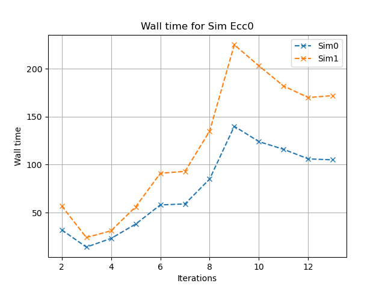
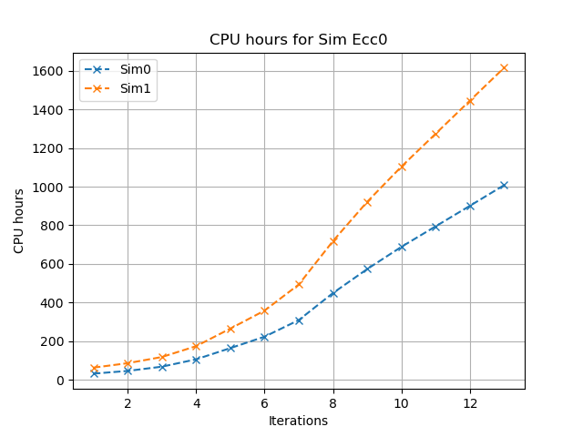
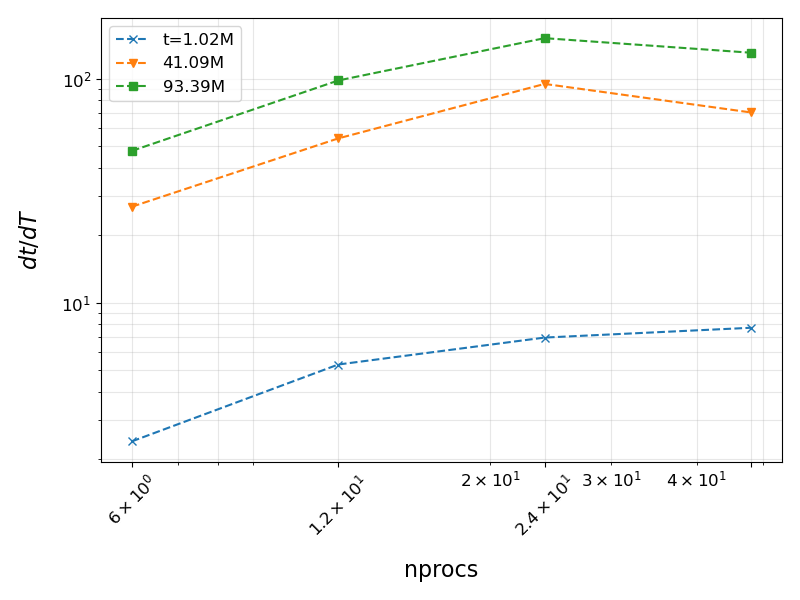
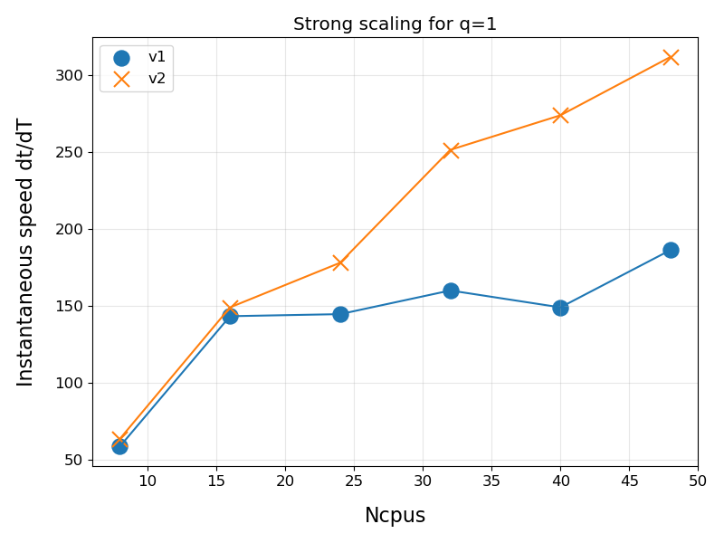

# Compile-time optimizations of SpEC on HPCs


# TL;DR

1. Compile-time optimizations of SpEC
2. Finding the latest and the best matching iter-compatible library versions
3. Different compilers (GCC, clang, aocc; incomplete study)
4. Different math libraries (lapack, openBlas, aocl; incomplete study)
5. Profiling (sampling and instrumentation) and benchmarking SpEC BBH runs
6. Consistent avx2, fma, pic, lto (!) optimizations at O3. Dynamically linked executables.

# Introduction
In this document, I describe the compile-time optimizations (experimented between Nov 2022 and March 2023) that led to significant performance improvements in Binary Black Hole simulations using SpEC. 
This document is relevant for HPCs with x86-64 CPUs, especially for AMD CPUs. It also implements many generic CPU optimizations.

This is the result of an experimental exercise I carried out on the [Sonic HPC](https://it.icts.res.in/docs/sonic-cluster/) at the Astrophysical Relativity Group, ICTS-TIFR, Bengaluru India. Although this document is concerned specifically with SpEC compile-time optimization, this document can serve as a blueprint for compile-time optimization of any software.


## Performance and optimization
Performance and optimization are important to the development and usage of HPC codes. They improve the quality of the code, reduce the memory footprint, and make it more efficient, saving valuable computing resources and reducing the carbon footprint. 

The basic philosophy behind improving the performance of a code can be broadly classified into three categories:
1. Avoid unnecessary work. Using the right language tools only to do the required work succinctly and efficiently.
2. Parallel programming. Using all available computing resources, cores, and accelerators.
3. Use all hardware capabilities. In the context of CPUS, as CPUs evolve, they are equipped with increasing hardware instruction-level capabilities that can perform the same set of operations faster and more efficiently or in a lesser number of instruction cycles. 

(Hopefully more on 1 and 2 in the future!)

### Why compile-time optimization?

Optimizations in 1 and 2 above are usually done in the development phase and require changes to the source code. While certain aspects of point three require changing the source code, certain other aspects of it do not require changing the source code. From one perspective, this is simpler than the other two. Compile-time optimization is one such approach. This article is only concerned with the third point above. The aim is to use the compiler's available capabilities to make the most of the HPC's hardware capabilities. 

1. Modern c/c++ compilers are gaining increasing sophistication in emitting efficient and optimized code from sources tailored to the hardware. 
2. Many high-performance scientific numerical codes like SpEC depend on an array of third-party libraries that implement various mathematical operations and numerical algorithms that are widely and frequently called e.g. `BLAS`, `GSL`, etc. Optimizing these for the native hardware leads to performance benefits.
3. Modern processors support SIMD advanced vector extensions that can significantly improve the throughput.
4. Modern processors, especially those from AMD (as of 2024) have large caches, leading to improved cache hit/miss ratio, resulting in immediate performance improvements.

All this can be obtained without having to change the source code.

In general software applications, the priority of the developers is towards adaptability and compatibility to a wide range of hardware capabilities and security. This brings severe limitations to the type of optimizations that can be carried out. However, for scientists/numerical relativists, performance (without loss of accuracy) is the priority. We often deal with a limited range of HPC hardware that does not change on a day-to-day basis. Thus it makes sense to invest time in carefully tailoring the software we use to the available hardware to make use of all its hardware capabilities, sacrificing portability. This document describes one such undertaking.

## General approach
1. **Find CPU capabilities**. Find out the hardware capabilities of the CPU and what major modern institutions are supported by them and turn them on at compile time. In most cases, most performance gains result from the use of all the native instructions, especially the `AVX` instruction sets. I recommend using `avx2` over `avx512`. Although `avx512` does result in performance gains over `avx2`, this is not always the case in my experience. One of the reasons is that `avx512` is power-hungry and results in more thermal throttling. Furthermore, it is more common to find and group e.g. 8 double data types to perform a 256-bit vector operation than a 512-bit one.
2. **FMA**. The use of `FMA` leads to performance gains. However, it is to be noted that if math is not written safely, this can lead to large errors. E.g. take a look at the section [below](#issues-with-fma).
4. **Linking**. The use of static linking often leads to better performance. When profiling, it is advantageous to use dynamic libraries with `PIC`/`PIE`.
5. **Lib versions**. Using the latest version of libraries e.g. SpEC ID solver uses `PETSc` internally. The use of recent versions showed performance benefits.
6. **Source**. Always consider compiling from source instead of using pre-compiled binaries.
7. **Consistent compiling**. Once the optimization flags are chosen,
 1. ensure the compilation of all the third-party libraries and the main application (SpEC here) with the same flags.
 2. compile all dependencies, third-party software, and the main application with the same compiler.
7. **Compilers**. Common choices are `clang` (`llvm`, `amd`), Intel (`icc`), `gcc`.
   1. On AMD machines, use AMD's new clang compiler, available in the `AOCC` compiler suite. This is supposed to lead to code that is adapted to AMD CPUs. However, AMD's `clang` could not be used to compile SpEC successfully will all optimizations turned on, due to possible bugs. I will talk about this later.
   2. On Intel machines, it is the Intel Parallel Studio or `icc` for the c/c++ compiler.
   3. The performance of `GCC` is very much comparable to that of Clang on AMD CPUs.
9. **Optimization flags**. For all production code, use `O3`, and for debugging use `Og`.
10. **Avoid Ofast**. Although `Ofast` leads to faster performance, it turns on many unsafe math operations and discards FP checks leading to a loss in accuracy at the least. It is highly discouraged to turn this option on.
11. **Linear Algebra libraries**. 
    1. On AMD CPUs, `openBLAS` gives the best performance.
    2. On intel, it is the `MKL`.
    3. A newer version of `LAPACK` has comparable performance to `openBLAS` on AMD systems.
    4. Intel `MKL` often performs better than `LAPACK` on AMD systems, provided a fix is implemented. Please contact me directly for more information.
12. **OpenMP** is favorable from a performance perspective. However, I am not confident of thread safety and race conditions with `SpEC`.
13. **MPI**
    1. `openMPI` is favorable on AMD systems.
    2. intel `MPI` on Intel systems.
14. **AMD AOCC/AOCL**. AMD has recently come up with a suite of Linear algebra, math, and low-level `mem` implementations (`AOCL`). This will definitely result in better performance, cache usage, and memory operations. However, the initial versions (4.0) were buggy and could not be successfully tested with `SpEC` (e.g. newer versions of `hdf5` would not compile with `AOCL` and `AOCC`). Something for the future.
15. **Other optimizations**.  more time-consuming, manual, and advanced optimizations that require profiling and are iterative. These are not recommended for most people. This includes profile-guided optimizations and operations like tuning the depth of loop unrolling.
16. **Avoid Network storage devices**. Running `SpEC` over NAS storage or any network-connected storage is not recommended. Apart from latency issues, on Sonic, I found that SpEC hangs every time a packet is dropped, and the MPI processes are exposed to race conditions, even if TCP is used.
17. For benchmarking certain third-party linear algebra libraries with various combinations of compilers, please refer to www.gitlab.com/vaishakp/benchmarks.git
18. **glibc**. `glibc` is one of the most important libraries that determines performance. Usually, the Linux kernel is inseparable from glib versioning. This means that one cannot upgrade `glibc` safely and consistently without recompiling the kernel. I highly recommend using `glibc > 2.34`, especially on AMD systems.
    1. On older versions, `glibc` was not correctly parsing the available cache on most AMD and some intel systems. This was a huge disadvantage to the newer AMD processors:
        |glibc 2.17                                                                                    |  glibc 2.34 |
        :---------------------------------------------------------------------------------------------:|:--------------------------------------------------------------------------------: |
        | |   |
       
    3. On older versions, a certain part of the code in `glibc` contributed by a certain corporation was forcing slower code paths on AMD systems.
    4. The implementation of various math libraries has been improved in newer `glibc` versions with e.g. vector intrinsic support. If the HPC OS is using older `glibc` versions, I recommend upgrading the OS.
    5. It is difficult to compile older `gcc` versions ( $\approx$ < 13.2) on newer glibc ($\approx$ >2.17) as some packages (that were not being maintained) that `gcc` depends on had been dropped from the Kernel. This was fixed in newer versions of gcc.
19. **cmake**. `cmake` is the preferred build system for various dependent packages (like `petsc`). Recent versions of cmake > 3.25.2 fail to compile if the storage is network-attached. 
19. **Other experiments**. Details on additional experiments with `SpEC` can be found at https://gitlab.com/vaishakp/spec-on-hpcs
    
## Compiling SpEC
### Versions of third-party libraries used (as of March 2023)

We recommend setting up third-party libraries in a separate location, preferably on SSDs. Although SpEC execution speed is not expected to be affected by the storage disk type (as everything is loaded into RAM before executing) as SpEC is not I/O intensive, using faster disks greatly reduces the compile time. 

We will use [environment modules](https://modules.readthedocs.io/en/latest/INSTALL.html) to manage the loading and unloading of libraries.


The following is a list of libraries that have been successfully compiled and used with SpEC and have had the best (yet) performance. This is informed by profiling.

1. [Environment modules](https://modules.readthedocs.io/en/latest/INSTALL.html). Setup manually.
2. [perl](https://www.perl.org/get.html) 5.16.3, 5.31.1. Have noted compatibility issues on newer versions of Perl with SpEC.
1. [GCC](https://gitlab.com/vaishakp/pkginstaller/-/blob/983aa9a74ddaf9a23c1546e10372e2637e08bb84/packages/gcc.sh) 11.1.0
1. [texinfo](https://gitlab.com/vaishakp/pkginstaller/-/blob/983aa9a74ddaf9a23c1546e10372e2637e08bb84/packages/texinfo.sh) 7.0.2
2. [make](https://gitlab.com/vaishakp/pkginstaller/-/blob/983aa9a74ddaf9a23c1546e10372e2637e08bb84/packages/make.sh) 4.4
4. [hwloc](https://gitlab.com/vaishakp/pkginstaller/-/blob/983aa9a74ddaf9a23c1546e10372e2637e08bb84/packages/hwloc.sh) 2.9.0
5. [cmake](https://gitlab.com/vaishakp/pkginstaller/-/blob/983aa9a74ddaf9a23c1546e10372e2637e08bb84/packages/cmake.sh) 3.25.2
6. [knem](https://gitlab.com/vaishakp/pkginstaller/-/blob/983aa9a74ddaf9a23c1546e10372e2637e08bb84/packages/knem.sh) 1.1.4
7. [xpmem](https://gitlab.com/vaishakp/pkginstaller/-/blob/983aa9a74ddaf9a23c1546e10372e2637e08bb84/packages/xpmem.sh) 2.6.5
8. [openmpi](https://gitlab.com/vaishakp/pkginstaller/-/blob/983aa9a74ddaf9a23c1546e10372e2637e08bb84/packages/openmpi.sh) 4.1.4
10. [fftw](https://gitlab.com/vaishakp/pkginstaller/-/blob/983aa9a74ddaf9a23c1546e10372e2637e08bb84/packages/fftw.sh) 3.3.10
11. [gsl](https://gitlab.com/vaishakp/pkginstaller/-/blob/983aa9a74ddaf9a23c1546e10372e2637e08bb84/packages/gsl.sh) 2.7.1
12. [hwloc](https://gitlab.com/vaishakp/pkginstaller/-/blob/983aa9a74ddaf9a23c1546e10372e2637e08bb84/packages/hwloc.sh) 2.9.0
13. [hdf5](https://gitlab.com/vaishakp/pkginstaller/-/blob/983aa9a74ddaf9a23c1546e10372e2637e08bb84/packages/hdf5_git.sh) 1.14.0
14. [papi](https://gitlab.com/vaishakp/pkginstaller/-/blob/983aa9a74ddaf9a23c1546e10372e2637e08bb84/packages/papi.sh) 7.0.0
15. [petsc](https://gitlab.com/vaishakp/pkginstaller/-/blob/983aa9a74ddaf9a23c1546e10372e2637e08bb84/packages/petsc.sh) 3.18.4 
17. [lapack](https://gitlab.com/vaishakp/pkginstaller/-/blob/983aa9a74ddaf9a23c1546e10372e2637e08bb84/packages/lapack.sh) 3.11.0

Note:
1. A master script to initiate the compilation and installation of this third-party software can be found [here](https://gitlab.com/vaishakp/pkginstaller/-/blob/983aa9a74ddaf9a23c1546e10372e2637e08bb84/StartCompile.sh).
2. Make sure you set the variable `SOFT_ROOT` in the main `pkginstaller` script.
1. Comment/ uncomment the corresponding lines to install specific software only.
2. Please preserve the ordering of the software install.
3. Please use the default flags "-O3 -march=native -fPIC" for all dependent software not listed above.
4. If you find any broken links/issues with the pkginstaller script above, please raise an issue [here](https://gitlab.com/vaishakp/pkginstaller/-/issues), even if you could fix it yourself. This will improve the script and help others.
5. These should be strictly treated as templates and are not designed to work out of the box. Please make necessary changes depending on your system type before proceeding.


#### Other
Not used in the below benchmarks, work in progress.
1. aocc-compilers 4.0.0
2. aocl 4.0.0
   1. amd-blis
   2. amd-libflame
   3. amd-fftw
   4. amd-libm
   5. amd-libmem


# CPU specs

1. AMD Epyc 7352, 48 core CPU (24 x 2)
2. 2.3GHz (3.2GHz)

## Memory Bandwidth

Measured through STREAM, the memory bandwidth is about 1790 GB/s or 1680 GiB/s (Isn't this too much? Typical 3200MT/s Dual channel RAM has 206 GB/s theoretical bandwidth. Is this because of multiple channels?)

Function    Best Rate MB/s  Avg time     Min time     Max time
Copy:         1720740.1     0.000103     0.000093     0.000148
Scale:         994205.4     0.000169     0.000161     0.000202
Add:          1471685.6     0.000174     0.000163     0.000196
Triad:        1833575.5     0.000162     0.000131     0.000215


### Compiler flags
The following flags were used to compile ALL the software/libraries:
`-mavx2, -mfma, -fPIC, -O3, -march=native`


#### Do we need PIC/PIE, shared/static libraries?
1. PIC/ PIE refers to position-independent code and executable respectively, allowing computer programs to run core irrespective of their location in memory.
2. The flags `-fPIC` and `-fpic` are usually different, with the latter generating more machine-specific code (at the cost of portability) that is faster and smaller in size.
3. In the olden days, memory was minimal and we didn't have virtual memory. It was advantageous to be able to execute a program that has fragmented code anywhere in the memory.
4. If we wish to build an application with PIC/PIE enabled, then it could use either static or dynamic (shared) libraries (or both). However, they must all be compiled with PIC enabled.
5.  Compiling and linking a static library with a shared library results in the code of the static library being copied into the dynamic library.
6.  It is advantageous to compile an application like SpEC with shared libraries due to modularity in the dependencies. This would be useful, e.g. in benchmarking.
7.  Statically linked applications used to be marginally faster than dynamically lined ones, since there is no overhead time in looking up for the libraries at run time. However, this difference is now very negligible.
8.  Statically linking is also faster because of better opportunities for optimization due to the monolithic nature. However, link-time optimization has almost made this moot.
9.   Compiling shared libraries without ` PIC` usually does not end well.
10.   A PIE is fully made of PIC-supported code.
11.   Dynamic linking can be enabled in SpEC by setting the env variable `DYNAMIC_LINKING=true` (recommended). This will pass the PIC/PIE flags to the compiler.

### Possible issues with FMA
`FMA` itself is [IEEE 754](https://ieeexplore.ieee.org/document/8766229) compliant and leads to performance and accuracy gains. However, some isolated examples or math expressions exist, which should be trivially zero, that lead to anomalous loss of accuracy, typically at the level of 1e-7 for single and 1e-14 for double precision operations due to representation errors. E.g. consider
```
#include <iostream>
#include <cmath>

// Prevent caching in registers to
// avoid read/write conversion/representation
// errors
volatile float x = -0.4876543210191;
volatile float alpha = 3.345345439887;

using namespace std;

int main()
{
    float u1 = x * cosf(alpha);
    float v1 = x * sinf(alpha);
    float u2 = x * cosf(alpha);
    float v2 = x * sinf(alpha);
    float du = u1 - u2;
    float dv = v1 - v2;
    float rms = sqrtf(du * du + dv * dv);

    //cout << "u1: " << u1 << "\t u2:" << u2 << "\n"; 
    //cout << "v1: " << v1 << "\t v2:" << v2 << "\n";
    //cout << "du:"<< du << "\t dv:" << dv << "\n";
    cout << "rms: " << rms << "\n";

}
```


The following can be observed when the above code is run (with e.g. `gcc-13.3`):
1. If `fma` is enabled, the above outputs `rms: 5.43286e-09` and not zero. Note that '-march=native' enables this on supported CPUs.
3. But these are close to precision errors and lower than roundoff errors.
4. Increased precision would result in lower errors but the above statement will hold. Therefore these are not of serious concern.
5. By default, `gcc` sets `-ffp-contract=fast`, enabling `fma` if the hardware supports it on all optimization levels greater than `O1`
6. To turn off `fma` correctly, one needs to use `-ffp-contract=off`. `-mno-fma` does not suffice. In this case, one gets `rms =0`
7. If the std outlines are uncommented, `fma` is not used as intermediate values like `u1, u2, v1, v2, du, dv` are accessed. This holds true even if `fma` is turned on.
8. Setting `-ffp-contract=on` turns on `fma` only if the chosen language standard supports it. E.g., for c++11 or 17, `fma` is not used across statements but only within an expression.
9. If the language std is not specified, the default is `-ffp-contract=fast` i.e. contraction happens across statements.
10. Use of other cos, sin  overloads (double) results in `rms: 0` with `fma` on.

#### Difference in assembly code

The above shows the differences in the assembly code generated by gcc with (LHS) and without FMA.

Notes:
1. When `fma` is turned on (LHS), native SIMD instructions (`vfmsub132ss`, `vfmadd132ss`, etc.) are used  to carry out FMA.
2. On the RHS, `fma` was turned off with `-ffp-contract=off`. Here, only scalar operations are used (`vmulss`, `vsubss`, etc.).
3. The `SSE` `xmm` registers are being used in both cases. SSE suffices to handle up to four single precision floating point numbers as the `xmm` registers are 128-bit wide.
4. The code with FMA on (i.e. LHS) completes the execution with (4) fewer instructions because of FMA.


## Compiling SpEC
To be added
### ~/.SpEC
### configure
### Support/Machines.pm
### Machine definition
### Machine environment
### flags
### Tests


Some tests on SpEC fail at the file comparison stages if compared with output in existing  Save directories. It is recommended to re-generate tests in these cases.

## Results
`SpEC` was compiled and installed on `sonic` with dynamic linking. The storage in use was a BeeGFS non-SSD spinning disk.

1. Here, "0" is the optimized version of SpEC with custom-compiled libraries using `gcc-11.1.0`. "1" is spack-compiled SpEC (with `spack`-compiled external libraries) using `gcc-9.4`.
1. The system is a simple equal mass, nonspinning BBH. Parameters can be obtained from [here](q1a0Params.input).


### ID solver
These plots are obtained with optimization level 1 (i.e. with older glibc). Newer plots to be updated.




#### ID hotspots
Time spent by SpEC ID solver in different libraries.


SpEC ID solver is also heavily PETSc dependent (as expected). Optimization of PETSc may have been one of the main reasons for the improved performance.


Please note that the performance sampler reported in the image above was used with optimization version 1 (older glibc). Thus the use of slower (SSE) codepaths.

### Evolution

The plot below shows the evolution benchmark of SpEC performed on an equal mass ratio non-spinning BBH simulation.


Benchmark for $q=4$:


Parameters can be obtained from [here](q0p25a0Params.input).

Evolution speed $\dfrac{d t}{dT}$ for optimization level 1 at Lev1, 2 and 3 are 210, 180, 115 $Mh^{-1}$. 

#### Inferences
1. Consistent optimizations of SpEC result in noticeable improvements (20% - 133%) in evolution speeds.
2. I found issues in older glibc versions (<v2.34) that were responsible for slower code paths on AMD systems. Upgrading to a version that fixes these bugs results in a further 75% performance improvement. This can mostly be attributed to:
   1.  vector instructions
   2.  faster implementations of low-level mem operations
   3.  correct reading and usage of cache on AMD systems. 
4. Partial link-time optimization of SpEC source code surprisingly results in slower performance. Need to test all lib optimization.
5. Note that `xpmem` and `knem` were turned off in glibc-2.34 compilation. These are expected to further add to performance improvements.
6. Preloading `amd-libmem` should also lead to further improvements, as SpEC seems to spend considerable time in mem operations.


Please note that the performance sampler reported in the image above was used with optimization version 1 (older glibc).

#### Profiling

Using a sampling or an instrumentation profiler, we can measure the performance of our application in detail. E.g., By [using the bundled performance analysis tool `perf`](perf.md) and the following command, one can learn more about an application:

```perf stat --event cache-references,cache-misses,cycles,instructions,branches,faults -p <pid>```

A typical SpEC ID process has the following cache stats (after optimization i.e. v2):
```
    16,955,831,905      cache-references:u                                                    
       415,235,758      cache-misses:u                   #    2.449 % of all cache refs       

      41.040245971 seconds time elapsed
```
A typical SpEC evolution process has the following stats (after optimization i.e. v2):

`perf` was used to obtain these samples. 

```
89,480.31 msec task-clock:u                     #    1.000 CPUs utilized             
                 0      context-switches:u               #    0.000 /sec                      
                 0      cpu-migrations:u                 #    0.000 /sec                      
            12,520      page-faults:u                    #  139.919 /sec                      
   273,962,868,189      cycles:u                         #    3.062 GHz                         (83.33%)
    14,372,623,730      stalled-cycles-frontend:u        #    5.25% frontend cycles idle        (83.33%)
   131,593,137,365      stalled-cycles-backend:u         #   48.03% backend cycles idle         (83.33%)
   559,504,990,729      instructions:u                   #    2.04  insn per cycle            
                                                  #    0.24  stalled cycles per insn     (83.33%)
    76,270,339,450      branches:u                       #  852.370 M/sec                       (83.34%)
       249,317,573      branch-misses:u                  #    0.33% of all branches             (83.33%)

    20,576,372,790      cache-references:u                                                    
     1,989,993,791      cache-misses:u                   #    9.671 % of all cache refs

      89.482851720 seconds time elapsed
```

1. Frontend (fetch and decode) stalls refer to the frontend pipeline not feeding $\mu$Op instructions to the backend pipeline. This could be due to cache misses, failure to decode complex instructions (which is more probable in JIT compilers)
2. Backend (execution) stalls refer to instructions not retiring on time. This could be due to memory-bound or CPU-bound stalls.
   1. The former can happen due to demand load/store instructions i.e. when, e.g. data to compute on is not found in memory and the processor has to look in slower memory. 
   2. The latter can occur when there are complicated math operations (like square root, and divisions) that could take longer to complete.

A bandwidth-limited stall can occur in a dependency chain. Although modern processors support out-of-order instructions and simultaneous reading from cache and memory, if instruction B depends on the outcome of A, then B gets stalled. Parallelization is not further possible. 
A may cause further stalls if it involves longer latency operations, or due to insufficient memory bandwidth. A dependency chain can benefit from faster ALUs and/or RAM. If this is true, then SpEC can benefit from overdecomposition.

Usually, memory-bound stalls may also show cache misses.

##### Evolution hotspots 
Time spent by SpEC evolution in different libraries.


By [using `gprof`](gprof.md), one can find out where most of the computation is spent in.


###### Analysis 
To be added


#### Analysis and Observations:

1. Frontend pipeline stalls are low. Also consistent with decent IPC.
2. 48% of backend cycles (the pipeline here is responsible for executing instructions) are stalled. This means that new dependent CPU instructions are waiting in the pipe.
3. There are two types of CPU backend stalls.
   1. Memory-bound.This backlog in the pipeline happens when the cycles are waiting for data to arrive from the memory.
   2. CPU-bound. The other is when instructions are not retiring when they are expected to. Math-intensive operations (e.g. division) involve instructions that finish in more than one cycle. This is the reason for SpEC's backend backlog.
4. SpEC could benefit from backend-bound tuning. E.g. more loop unrolling may improve this.
5. The above and point 5 below indicate that SpEC backend stalls are core-bound and not memory-bound. This is understandable because RHS evaluations make up most of the computing load in SpEC.
6. A cache hit ratio upwards of 95% is considered good. Here we have about 97% in the ID stage and 90% in the Evolution stage.
7. Branch misses are pretty good. Large branch misses can lead to a wastage of CPU cycles.
8. RAM usage was only 0.1% for each of the 48 processors and a large amount (of 250GiB) was unused in the system. Is SpEC forcibly trying to use less memory without consideration of available memory due to historical reasons? This also supports CPU-bound backend pipeline stalls.
9. Page faults of 140/sec are high, and can significantly affect the performance. This is concerning because ample RAM was available (see point above). The page size was 4096kB. Again, is SpEC being frugal on the memory budget?
More coming up...

#### References:
1. https://faculty.cs.niu.edu/~winans/notes/patmc.pdf
2. https://www.intel.com/content/www/us/en/docs/vtune-profiler/cookbook/2023-0/top-down-microarchitecture-analysis-method.html


### Scaling

Scaling results on SpEC are not very useful -- this is because SpEC can only use MPI ranks equal to the number of subdomains available. This means SpEC is limited to around 70 MPI ranks.




# Long simulations


Please note that the first plot is still in the Junk radiation phase ($t\sim100M$). The second one shows the speeds at $t\sim 930M$. 

#### Inferences
1. The Optimized (v2) SpEC scales better than v1, almost linearly within a node.
2. Tests involving more than one node are underway.
3. The better scaling in v2 is suggestive of efficient use of all the codes, and lesser idle time. This is primarily facilitated by better use of vectorization, FMA and better cache hits.

# Conclusions
1. Compile-time optimizations are usually one of the final stages of performance optimization in software programming. This allows us to squeeze out the best performance given the software and the hardware without changing either.
2. Investing time in carefully optimizing HPC software at compile time can result in noticeable performance improvements and speedups.
3. For SpEC with `gcc` compiled software, the ID solver can have upto 90% speedup.
4. Modern vector extensions like `avx` and glibc versions can severely impact the performance of applications.
5. The evolution has a speedup of about 40%. Upgrading `glibc` to version `>= 2.34` contributes to almost half of this.
6. Compiling libraries manually seems to have better performance compared to using spack. The reasons for this may be because
   1. Unless overridden, spack downloads precompiled binaries that suit the native arch. In this process, certain optimizations may not be implemented.
   2. The behavior of spack compilation flags in the default scenario. Does it use it consistently?
   3. `gcc-11.1.0` may have better compiler optimization capabilities over `gcc-9.4` used here for spack compiled SpEC's benchmark. Also for other third-party libraries.
7. Overall, optimization can result in at least 15% more runs which would e.g. directly benefit surrogate and modeling.
8. 

# Outlook/ ToDo

1. More than one node (~ 25% faster)
2. Link time optimization
3. Compile and use xpmem/knem
4. Profile guided optimization
5. fine tuning (e.g. unrolling loops)
6. Use AMD's AOCC and AOCL (evidence exists for better machine code and mem bandwidth)
